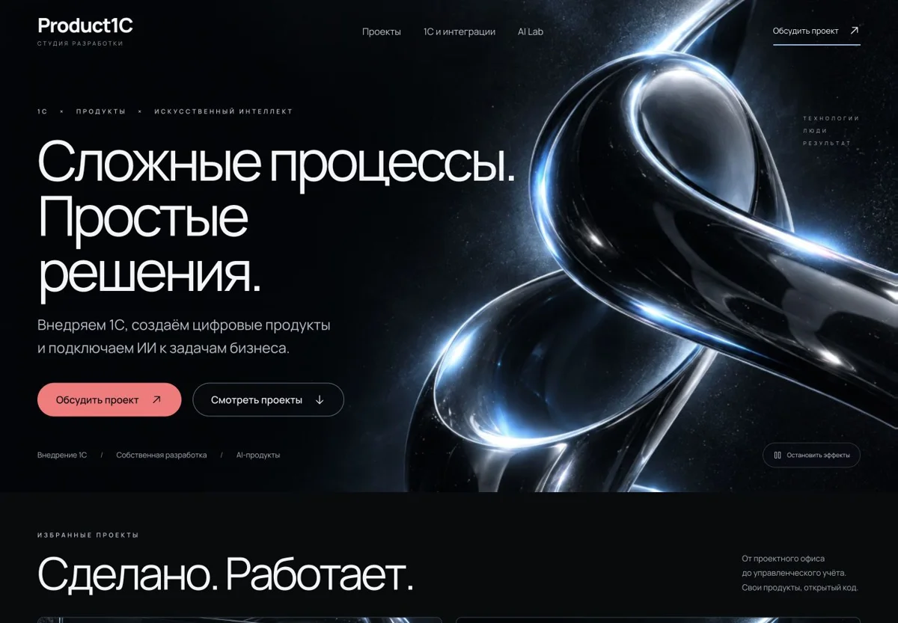
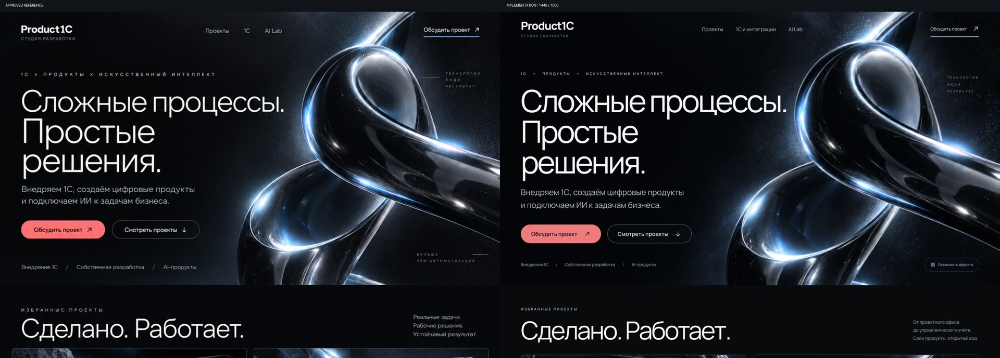
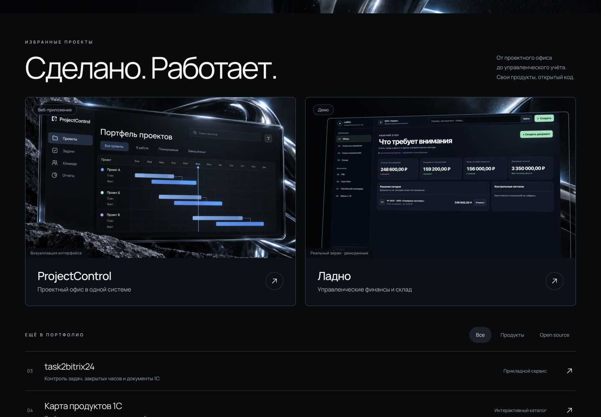
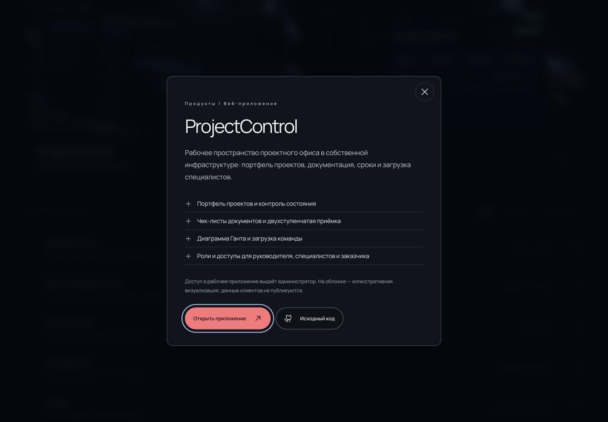
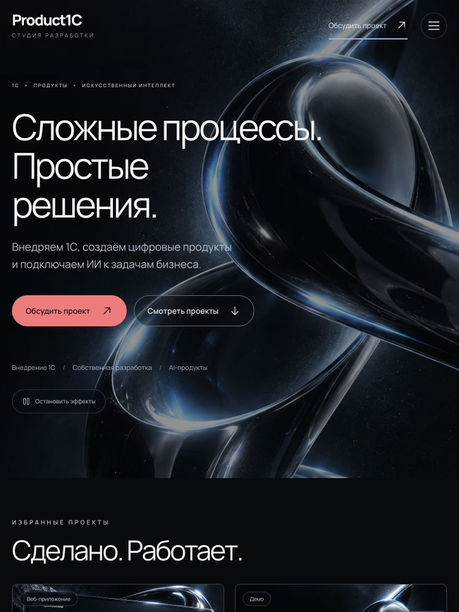
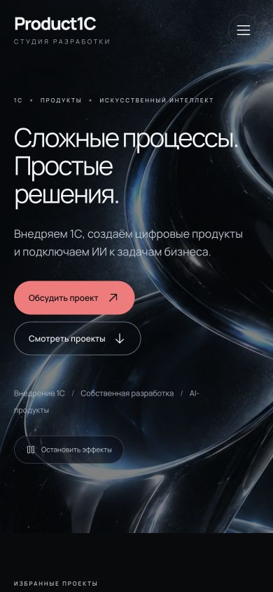

# Product1C

Сайт студии Александра Литвиненко: внедрение 1С, интеграции, собственные веб-продукты и прикладной ИИ. Тёмный хромированный дизайн и эффект глубины на WebGL.

**[Открыть сайт →](https://beautydesign.product1c.ru)** · [Обсудить проект в Telegram](https://t.me/DED_GENA)

Код лежит в закрытом репозитории, здесь описано, что на сайте и как он сделан.

## Что на сайте

- **Первый экран:** хромированный объект с эффектом глубины, который реагирует на курсор, и три строки заголовка.
- **Портфолио:** ProjectControl, Ладно, task2bitrix24, Карта продуктов 1С, AI × 1C Guide, education1c и Ondal. Есть фильтры, а подробности открываются в диалоге.
- **Экспертиза 1С:** внедрение, интеграции, собственная разработка.
- **AI Lab:** НейроКомпания и MVP ИИ-оценки кандидатов.
- **Процесс работы и контакт** через Telegram.

У каждого проекта подписано, демо это, прототип или рабочее приложение. Клиентских данных и выдуманных показателей на сайте нет.

## Как это сделано

1. **Референс и макеты.** Ориентир — визуальный язык [Layers](https://www.getlayers.ai/): крупная типографика, фактурные материалы, свободная композиция. Код и изображения Layers не использовались. Из нескольких сгенерированных макетов я выбрал тёмную хромированную композицию и решил добавить 3D-эффекты.
2. **Графика.** Хромированный объект и иллюстрация ProjectControl созданы отдельно для проекта. Иллюстрация подписана как визуализация. Для Ладно снят реальный экран открытого демо с синтетическими данными.
3. **Вёрстка по макету.** Макет перенесён в адаптивный интерфейс от 320 px. После каждой итерации реализация сравнивалась с макетом наложением кадров.
4. **Проверка и публикация.** Статическая сборка выложена отдельным релизом и проверена в браузере на рабочем адресе.

  

## Эффект глубины

- Поверх статичной картинки работает WebGL-слой. Шейдер оценивает условную глубину по яркости, сдвигает текстуру относительно курсора и добавляет блик. Это 2.5D-эффект поверх картинки, 3D-модели нет: рисунок остаётся тем, что выбран в макете, но получает объём.
- Карточки проектов наклоняются в настоящей CSS-перспективе.
- Three.js загружается отдельно и только при точном указателе и ширине больше 800 px, если не включены экономия данных или выключение анимации.
- Частота ограничена примерно 30 кадрами в секунду. Рендер останавливается за пределами экрана и в скрытой вкладке.
- Если WebGL недоступен или текстура не загрузилась, остаётся исходное изображение. Кнопка «Остановить эффекты» убирает сцену целиком.

## Стек

React 19, Vite 6, Three.js, Phosphor Icons, CSS без UI-фреймворка, локальный шрифт Manrope. Сервер отдаёт только статику: HTML, JS, CSS, WebP и шрифты. Аналитики, cookies и форм нет.

## Чем подтверждено

Проверки 11 сентября 2026 года в Chromium:

| Что | Результат |
| --- | --- |
| Сравнение с макетом | три итерации правок: типографика первого экрана, ширина на 320 px, пропорции карточек |
| Размеры экрана | 320, 390, 768 и 1440 px — ширина документа равна ширине окна |
| Диалог проекта | открывается мышью и с клавиатуры, фокус остаётся внутри, Escape закрывает и возвращает фокус |
| Эффекты | пауза удаляет сцену, возобновление создаёт её заново |
| Рабочий адрес | изображения загружены, WebGL готов, в консоли нет ошибок, CSP не блокирует ресурсы |

Не проверялись: Safari, Firefox и реальные телефоны. Резервные ветки для потери GPU-контекста и системного выключения анимации заложены в коде, но аппаратно не эмулировались.

## Скриншоты

  
  
  

## Сторонние компоненты

React, React DOM, Vite, Three.js и Phosphor Icons распространяются по лицензии MIT, шрифт Manrope — по SIL Open Font License 1.1.

Автор — Александр Литвиненко · [Telegram](https://t.me/DED_GENA) · [GitHub](https://github.com/Aleksandr-Litvinenko)
